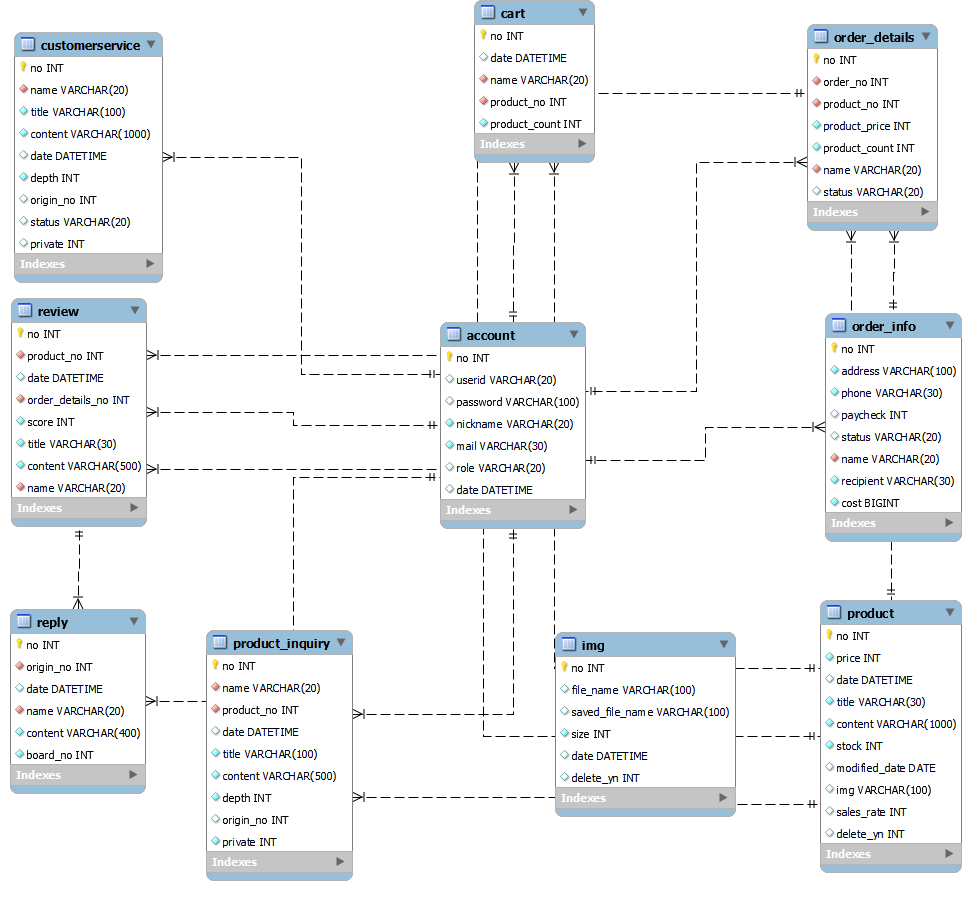

# 쇼핑몰 프로젝트

## 1. 프로젝트 기능

### 회원가입
    - 사이트 관리자, 일반 사용자로 구분한다.    
    - 아이디, 패스워드, 닉네임, 메일주소를 요구한다.
    - 아이디, 닉네임, 메일주소는 중복이 불가능하다.

### 아이디 찾기 및 비밀번호 찾기
    - 가입시 입력한 이메일 주소를 통해 아이디를 발송한다.
    - 비밀번호의 경우, 아이디와 이메일 주소를 입력하면 임시비밀번호를 발급한다.

### 로그인
    - 아이디, 패스워드 검증 후 유효시간 120분의 토큰을 발급한다.

### 상품
    - 상품등록은 관리자 권한이 있는 유저만 가능하며 이미지를 첨부 할 수 있다.    
    - 상세정보보기에서 재고량을 별도로 표시한다.    
    - 검색, 상세정보보기는 비로그인 유저도 가능하다.

### 상품문의
    - 로그인 한 유저만 작성할 수 있다.
    - 작성시 공개 여부를 결정 할 수 있으며, 비공개시 본인과 관리자 외에는 검색, 조회가 불가능하다.
    - 관리자와 작성자는 답글을 작성 할 수 있다.
    - 10개씩 페이징 처리를 한다

### 장바구니
    - 로그인 된 유저만 사용가능하다.    
    - 상품 추가, 수량 수정, 장바구니에서 제거 등을 할 수 있다.

### 상품주문
    - 로그인 된 유저만 상품을 주문 할 수 있다.    
    - 주문시 주소와 연락처를 요구하며, 고유주문번호를 부여하여 주문 진행상황을 조회 할 수 있다.    
    - 선택한 상품의 종류별로 상세주문번호를 부여하여 개별상품의 진행상황을 조회 할 수 있다.

### 결제(미구현)
    - 미정.

### 리뷰
    - 상품상세페이지에 표시되며, 비로그인 유저도 조회할 수 있다.    
    - 리뷰작성은 로그인 된 유저에 한하며, 상품구매기록이 있어야 한다.
    - 리뷰작성시 최고 10점의 점수를 부여할 수 있다.
    - 로그인 된 유저는 자신이 작성한 리뷰의 목록을 볼 수 있다.     
    - 리뷰 목록은 10개씩 페이징처리를 한다.   

## 2. erd

## 3. Trouble Shooting

## 4. Tech Stack

### 언어 JAVA(JDK 17)
### 서버 Tomcat 10.1.13
### 프레임워크 SpringBoot 3.1.4
### DB  MYSQL
### IDE Intellij 
